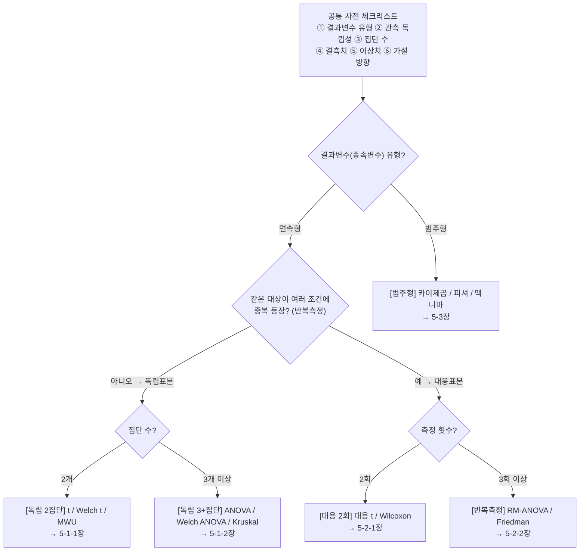
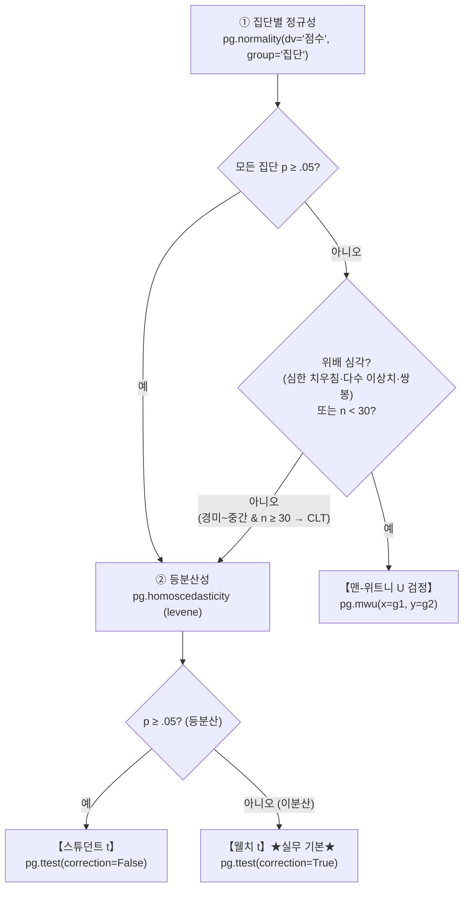
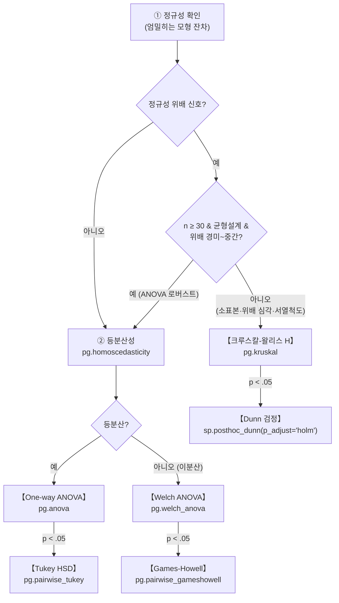
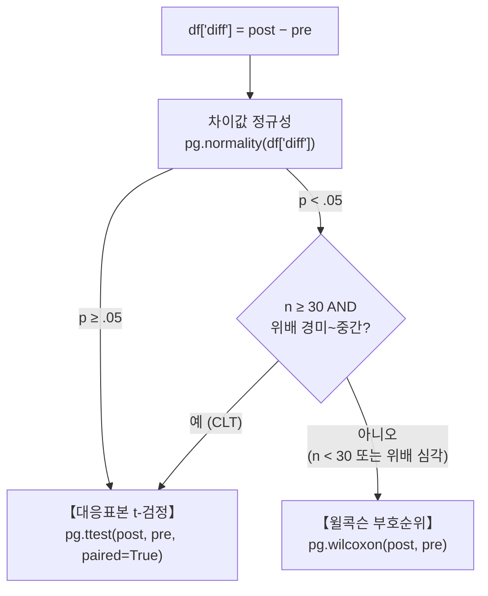
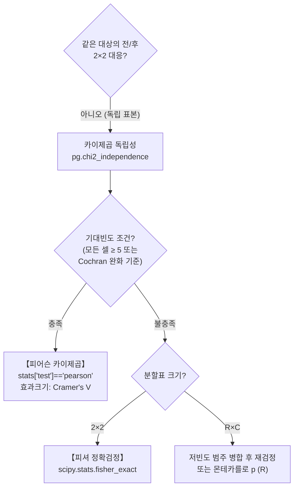
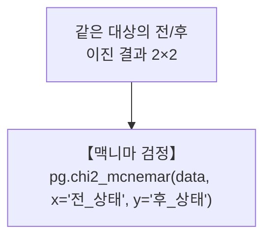

# 7월 5주차 학습 정리 — 데이터 분석 · 통계 · 가설검정 마스터노트

> **버전**: v3.0 (실행 예시·크램시트 추가판)
>
> **범위**: Pandas & 시각화 → 기술통계 → t검정/p-value → 회귀분석 → 가설검정 선택 가이드(pingouin) → 효과크기 → NumPy/NLP
>
> **이 파일의 사용법**: `⚡ 원페이지 요약`으로 전체 그림 → 각 섹션 심화 → `6장 실행 예시`로 실제 출력 해석 연습 → `실전 파이프라인` 코드 복붙 → `퀴즈`로 자기 점검

---

## 📖 목차

- [✅ 학습 진도 체크리스트](#-학습-진도-체크리스트)
- [⚡ 0. 원페이지 요약 (5분 복습용)](#-0-원페이지-요약-5분-복습용)
  - [0-1. 검정 선택 한눈에 보기 (결정 테이블)](#0-1-검정-선택-한눈에-보기-결정-테이블)
  - [0-2. 핵심 공식 5개](#0-2-핵심-공식-5개)
  - [0-3. p-value 30초 해석법](#0-3-p-value-30초-해석법)
  - [0-4. 전체 선택 플로우차트](#0-4-전체-선택-플로우차트)
  - [0-5. 원본 txt → 새 구조 대응표](#0-5-원본-txt--새-구조-대응표)
- [1. Pandas & 시각화](#1-pandas--시각화)
- [2. 통계 기초](#2-통계-기초)
- [3. t검정과 p-value (직관 중심)](#3-t검정과-p-value-직관-중심)
- [4. 회귀분석](#4-회귀분석)
- [5. 검정 선택 가이드 (플로우차트)](#5-검정-선택-가이드-플로우차트)
- [6. 실행 예시로 배우기 (실제 출력 해석)](#6-실행-예시로-배우기-실제-출력-해석)
  - [6-0. 분석 순서 5단계 프로토콜](#6-0-분석-순서-5단계-프로토콜)
  - [6-1. 예시 1 — 독립 2집단: A/B 교육방식 성취도 비교 (웰치 t)](#6-1-예시-1--독립-2집단-ab-교육방식-성취도-비교-웰치-t)
  - [6-2. 예시 2 — 대응표본: 운동 프로그램 전·후 체지방률 (대응 t)](#6-2-예시-2--대응표본-운동-프로그램-전후-체지방률-대응-t)
  - [6-3. 예시 3 — 독립 3집단: 세 가지 학습법 성취도 (ANOVA + Tukey)](#6-3-예시-3--독립-3집단-세-가지-학습법-성취도-anova--tukey)
  - [6-4. 예시 4 — 범주형 독립: 가입경로별 전환율 (카이제곱 + OR)](#6-4-예시-4--범주형-독립-가입경로별-전환율-카이제곱--or)
  - [6-5. 예시 5 — 반복측정 3시점: 중재 효과 추적 (RM-ANOVA)](#6-5-예시-5--반복측정-3시점-중재-효과-추적-rm-anova)
  - [6-6. 예시 6 — 대응 범주형: 캠페인 전·후 전환 (McNemar)](#6-6-예시-6--대응-범주형-캠페인-전후-전환-mcnemar)
- [7. 검정별 상세 레퍼런스](#7-검정별-상세-레퍼런스)
- [8. 효과크기 해석 기준표 & 다중비교 보정](#8-효과크기-해석-기준표--다중비교-보정)
- [9. 공통 주의사항 10계명 & 오개념 바로잡기](#9-공통-주의사항-10계명--오개념-바로잡기)
- [10. 실전 파이프라인 템플릿 (복사해서 쓰기)](#10-실전-파이프라인-템플릿-복사해서-쓰기)
- [11. 자기 점검 퀴즈](#11-자기-점검-퀴즈)
- [12. 용어 사전 (Glossary)](#12-용어-사전-glossary)
- [13. 참고 문서](#13-참고-문서)
- [14. 기타 팁 (NLP · NumPy)](#14-기타-팁-nlp--numpy)
- [15. 🚀 시험 직전 크램시트 (최종 1페이지)](#15--시험-직전-크램시트-최종-1페이지)
- [📝 변경 이력](#-변경-이력)
- [🏁 복습 루틴 제안](#-복습-루틴-제안)

---

## ✅ 학습 진도 체크리스트

> 복습할 때마다 체크하며 진행도를 관리하세요.

- [ ] Pandas: groupby 객체 계층 / apply·agg / reset_index와 시본 인덱스 문제
- [ ] 통계 기초: 기술 vs 추론 / 표준편차 vs 표준오차 / ddof / 상관계수
- [ ] t검정 & p-value: 걸음 수 직관, 신뢰구간 1.96, 이상치 영향, 1·2종 오류
- [ ] 회귀분석: R²의 의미
- [ ] 검정 선택 가이드: 독립표본(2집단/3+집단) / 대응표본 / 범주형
- [ ] 실행 예시 6종: 출력 보고서 해석 연습
- [ ] 효과크기 기준표 & 다중비교 보정
- [ ] 시험 직전 크램시트 1페이지 암기
- [ ] NumPy 벡터·행렬 연산, axis 방향

---

## ⚡ 0. 원페이지 요약 (5분 복습용)

### 0-1. 검정 선택 한눈에 보기 (결정 테이블)

| 상황 | 정규성·등분산 충족 | 비정규 / 소표본 | 효과크기 |
|---|---|---|---|
| 독립표본 2집단 | **스튜던트 t** `pg.ttest(correction=False)` | **맨-위트니 U** `pg.mwu` | d / RBC, CLES |
| 독립 2집단 (이분산) | **웰치 t** ★실무 기본★ `pg.ttest(correction=True)` | 맨-위트니 U | d / RBC, CLES |
| 독립 3+집단 | **One-way ANOVA** `pg.anova` → 사후 **Tukey HSD** | **크루스칼-왈리스** `pg.kruskal` → 사후 **Dunn** | η²p / η²_H |
| 독립 3+집단 (이분산) | **Welch ANOVA** → 사후 **Games-Howell** | 크루스칼-왈리스 | η²p / η²_H |
| 대응 2회 (전·후) | **대응표본 t** `pg.ttest(paired=True)` | **윌콕슨 부호순위** `pg.wilcoxon` | d / RBC, CLES |
| 반복측정 3회+ | **RM-ANOVA** `pg.rm_anova` → 사후 대응 t + 보정 | **프리드먼** `pg.friedman` → 사후 Conover | η² (ng2) / Kendall's W |
| 범주형 독립 (빈도) | **카이제곱 독립성** `pg.chi2_independence` | 기대빈도 조건 불충족 → **피셔**(2×2) / 병합·몬테카를로(R×C) | Cramer's V / OR |
| 범주형 대응 (전·후 2×2) | **맥니마** `pg.chi2_mcnemar` | 비일치 쌍 < 25 → `p_exact` 보고 | OR = b/c |

### 0-2. 핵심 공식 5개

| # | 공식 | 의미 |
|---|---|---|
| 1 | `t = (표본평균 − 주장값) / 표준오차` | 주장이 표본평균에서 **몇 걸음** 떨어졌나 |
| 2 | `표준오차 SE = s / √n` | **평균들의 퍼짐** (표준편차를 √n으로 나눔) |
| 3 | `95% 신뢰구간 = 평균 ± 1.96 × SE` | 평균 기준 1.96 걸음 안 = 안전지대 |
| 4 | `R² = 설명된 분산 / 전체 분산` | 종속변수 변동 중 독립변수의 지분 |
| 5 | `Cohen's d = (평균 차이) / (합동 표준편차)` | 효과크기 (0.2 / 0.5 / 0.8) |

### 0-3. p-value 30초 해석법

```
p < 0.05  →  귀무가설 기각 → "유의한 차이가 있다" (대립가설 채택)
p ≥ 0.05  →  기각 근거 부족 → "유의한 차이라고 말할 수 없다" (채택 아님!)
```

> ⚠️ p ≥ 0.05는 **"귀무가설이 맞다"가 아니라 "기각할 근거가 부족하다"** 입니다.
> ⚠️ p는 **"귀무가설이 참일 확률"이 아니라**, 귀무가설이 참일 때 이런(또는 더 극단적인) 데이터가 나올 **확률**입니다.

### 0-4. 전체 선택 플로우차트



*(Mermaid 다이어그램은 GitHub에서 렌더링됩니다. 상세 분기는 각 섹션을 참고하세요.)*

### 0-5. 원본 txt → 새 구조 대응표

| 원본 구조 | 새 파일 위치 |
|---|---|
| (0) 공통 사전 체크리스트 | [5-0장](#5-0-공통-사전-체크리스트-모든-분기-이전) |
| (1) 독립표본 경로 A / B | [5-1-1장](#5-1-1-경로-a--집단-2개) / [5-1-2장](#5-1-2-경로-b--집단-3개-이상) |
| (2) 대응표본 경로 A / B | [5-2-1장](#5-2-1-경로-a--2회-측정-전후-조건-12) / [5-2-2장](#5-2-2-경로-b--3회-이상-반복측정-예-전중후) |
| (3) 범주형 경로 A / B | [5-3-1장](#5-3-1-경로-a--독립-표본-독립성검정) / [5-3-2장](#5-3-2-경로-b--대응짝지은-범주형) |
| 3부 검정별 레퍼런스 | [7장](#7-검정별-상세-레퍼런스) |
| 4부 효과크기 통합표 | [8장](#8-효과크기-해석-기준표--다중비교-보정) |
| 5부 공통 주의사항 | [9장](#9-공통-주의사항-10계명--오개념-바로잡기) |
| 참고 문서 | [13장](#13-참고-문서) |

---

## 1. Pandas & 시각화

### 1-1. groupby 심화 — 객체 계층 구조

`df.groupby()`의 리턴 객체는 **Series가 아니라 `DataFrameGroupBy`** 라는 객체입니다.

```
df.groupby("q")            → DataFrameGroupBy  (index = 그룹 label 종류)
  └── [["k", "r"]]         → SeriesGroupBy
        └── .sum()         → Series  (index에 그룹 label, 값에 합계)
```

- `DataFrameGroupBy`의 index는 번호가 아니라 **매개변수에 인자로 들어간 label의 종류**
- 그룹 기준이 된 열은 일반 데이터 열이 아니라 **'줄 이름(인덱스)'이라는 특수한 지위**로 격상됨

### 1-2. apply와 람다

```python
df.groupby("q")[["k", "r"]].apply(lambda a: ...)
# 람다가 받는 값: "q" 별로 쪼개진 "k", "r"을 열로 가지는 DataFrame

s = df.groupby("q")[["k", "r"]].apply(lambda a: (a["price"] / a["carat"]).mean())
```

> ⚠️ **apply 안에 모든 연산을 다 넣어야 합니다.** 밖에 빼면 cut별로 나눈 값 **전체에 대한 평균**이 되어버립니다.

```python
s = df.groupby("q")[["k", "r"]].apply(lambda a: (a["price"] / a["carat"])).mean()  # (X) 전체 평균
```

### 1-3. agg vs apply

> **한 열이면 `agg`, 여러 열이면 `apply`**

- `agg`: 열 단위 집계 함수(mean, sum, max…)를 한 번에 적용
- `apply`: 그룹별로 쪼개진 **DataFrame 전체**에 임의의 함수를 적용 (람다로 커스텀 연산)

### 1-4. reset_index()

- **index에 값이 붙어 있는 Series**는 `reset_index()`로 떼어내 DataFrame으로 만들면 생각하기 편함
- 다른 풀이로 Series 상태 그대로 연산이 가능한 경우도 있음

#### ⭐ groupby + seaborn 인덱스 문제 (자주 만나는 에러)

- pandas에서 `groupby("hour")`를 하면 기준이 된 `"hour"`는 일반 데이터 열이 아니라 **'줄 이름(인덱스)'이라는 특수한 지위로 격상**됩니다.
- 시본(`sns.lineplot`)은 반드시 **'평범한 데이터 열 이름'만 인식**하는 고집이 있습니다. 인덱스로 올라간 `"hour"`는 시본의 눈에 보이지 않아 `x="hour"`라고 쓰면 *"어디에 hour라는 열이 있다는 거야?"* 에러가 납니다.
- 이때 `reset_index()`를 붙이면 인덱스에 있던 `"hour"`를 다시 평범한 데이터 열로 내려놓아 표가 평평한 일반적인 형태로 바뀌고, 시본이 `"hour"` 열을 인식해 그래프를 그립니다.

> **요약**: *"groupby 때문에 줄 이름(인덱스)으로 묶여버린 열을, 시본 그래프 함수가 가로축(x)·세로축(y)으로 알아볼 수 있게 '일반 데이터 열'로 탈바꿈해 주는 명령어"*

### 1-5. 시각화

- **boxplot + 밀도 = violinplot**
- **barplot = 평균(대표값)** 을 보여줌

**figure vs axes 객체**

| 객체 | 설명 |
|---|---|
| `axes` 객체 | 데이터가 실제로 플로팅되는 영역 |
| `figure` 객체 | axes가 여러 개 존재 가능한 전체 캔버스 |

**그래프 크기 설정 — 용도에 따라 구별**

| 방법 | 언제? | 특징 |
|---|---|---|
| `plt.figure(figsize=(가로, 세로))` | 그래프 **1개만 크게** | `ax` 변수 지정 없이 한 줄로 간결 |
| `fig, ax = plt.subplots(행, 열, figsize=(가로, 세로))` | **여러 개를 좌/우·상/하 배치** | 각 axes에 개별 plot |

### 1-6. 기타 pandas 팁

| 팁 | 내용 |
|---|---|
| groupby vs pivot table | groupby는 **nan을 표시하지 않지만** pivot table은 **nan을 표시** |
| merge 검증 | `validate = "m:1"` → 오른쪽 키가 유일한지 검사, 중복 시 에러 |
| loc | index가 실제 구분되는 것이므로 **loc이 더 편하게 사용됨** |
| `Boolean Series.sum()` | True는 1, False는 0 → **True인 행의 개수** return |
| `Series.value_counts()` | index에 고유 label, 값에 **등장 횟수**가 든 Series return. `.reset_index()` 하면 index의 label을 떼어 df의 열로 |

### 1-7. 검정별 추천 시각화 (무엇을 어떤 그래프로)

| 상황 | 추천 그래프 | 코드 예시 |
|---|---|---|
| 정규성 확인 | **Q-Q 플롯** + 히스토그램(kde) | `pg.qqplot(df['점수'])` / `sns.histplot(df['점수'], kde=True)` |
| 이상치 점검 | **박스플롯** | `sns.boxplot(data=df, x='집단', y='점수')` |
| 2집단 비교 | 바이올린 + 스트립 | `sns.violinplot(...)` + `sns.stripplot(..., alpha=.4)` |
| 대응(전·후) | **스파게티 플롯**(개인별 선) + diff 히스토그램 | `sns.lineplot(data=df, x='시점', y='점수', hue='id', legend=False)` |
| 3+집단 비교 | 집단별 박스/바이올린 + 평균±CI 에러바 | `sns.boxplot(...)` + `sns.pointplot(..., errorbar='ci')` |
| 범주형 연관 | **그룹별 비율 막대** (성공률 등) | `sns.barplot(data=df.groupby('가입경로')['전환여부'].mean().reset_index())` |
| 상관관계 | **산점도** (+ 추세선) | `sns.regplot(x=..., y=...)` |

> 💡 정규성 위배의 대부분은 이상치에서 시작 → **그래프를 검정보다 먼저** 그리고, 검정은 그래프의 확인용으로

---

## 2. 통계 기초

### 2-1. 기술통계 vs 추론통계

| 구분 | 정의 |
|---|---|
| **기술통계** | 가진 데이터를 분석 |
| **추론통계** | 표본으로 모집단을 추정 → 기술통계 결과를 전체 모집단에 확대해 일반화할 수 있는지 타진 |

### 2-2. 상관계수

- 피어슨 상관계수가 **0이어도** U자나 곡선형으로 연관이 있을 수 있음 (직선 모양이 아닐 뿐)
- **피어슨은 반드시 산점도와 함께** 해석

### 2-3. 확률분포 함수

| 상황 | 함수 |
|---|---|
| 이산형 확률 | `pmf` |
| 연속형 구간 확률 | `cdf(b) − cdf(a)`, `sf(k)` |
| 확률 → 값 역산 | `ppf(P)` |

### 2-4. ddof와 자유도

- **ddof = delta degrees of freedom = 자유도 감소량**
- `ddof = 1` → **n − 1로 나눈다** = 자유도를 1 감소시킨 것
- 자유도 1을 빼는 것은 **t분포** (표본 분산이 모분산을 살짝 과소추정하는 것을 보정)
- **정규분포는 자유도 개념이 없음**
- degrees of freedom = *the number of information required to know what it is* (모수를 추정하는 데 필요한 독립적인 정보의 수)

### 2-5. 표준편차 vs 표준오차 ⭐

| 개념 | 의미 | 코드 |
|---|---|---|
| **표준편차 (SD)** | **개별 데이터(사람들)** 의 퍼짐성 | `sg.std()` |
| **표준오차 (SE)** | **평균들의 퍼짐성** (표본평균의 표준편차) | `stats.sem(sg)` |

```
표준오차 SE = 표준편차 s / √n
```

> 원 데이터 분포에 대한 것이 아니라 **평균의 분포에 대한 추정**이므로 표준편차에서 √n을 더 나눠줍니다. 표본이 클수록 평균의 추정은 정밀해지므로 SE는 작아집니다.

### 2-6. 데이터 타입 구분

| 구분 | 종류 |
|---|---|
| 범주형 데이터 | 명목, 순서 |
| 수치형 데이터 | 등간, 비율 |

---

## 3. t검정과 p-value (직관 중심)

### 3-1. t 통계량 = "몇 걸음 떨어졌는가"

상대방이 *"모평균은 p일 것이야"* 라고 주장한다고 가정합시다.

```
t = (표본평균 − 주장값) / 표준오차
```

- t 값은 **상대방의 주장이 표본평균에서 몇 걸음 벗어났는가**를 따집니다.
  - `(표본평균 − 주장값)` = 순수한 오차
  - `표준오차` = 자연스럽게 발생할 수 있는 **상식적인 보폭**
- 모두 표본평균으로 구하는데, 표준오차는 표준편차에서 **√n을 더 나눠줍니다** (평균 분포 기준이므로).
- **p-value** = 그 걸음 수 **밖**에 데이터가 존재할 확률 (내가 구한 t점수보다 더 바깥쪽 **꼬리 부분의 면적**)

### 3-2. t분포 그림으로 보는 p-value

```
         t분포 (자유도에 따라 모양이 달라짐)
                │
   ┌────────────┴────────────┐
   │  ← 꼬리 면적 (p-value)   │
   │                          │
  t=2.96                     0
  (3걸음)                  (주장값 위치)
```

- 가운데(0)가 "주장값 = 표본평균"인 위치
- t=2.96처럼 꼬리 쪽에 찍히면 그 **바깥 면적(p-value)이 작아짐** → 주장이 말이 안 됨
- t=−0.45처럼 가운데 부근이면 바깥 면적이 큼 → 흔한 일 → 주장이 안전지대

### 3-3. p-value 해석 예시 2개

**예시 1 — t값이 −0.45 (반 걸음)**

- 더 바깥쪽 꼬리 면적 = **0.6478**
- 100번 조사하면 64번은 일어나는 일 → **흔한 일** → 주장은 안전지대 안에 있음
- p-value = 0.6478 > 0.05 → **귀무가설 채택(기각 못 함)**

**예시 2 — t값이 2.96 (3걸음)**

- 더 극단 바깥쪽 꼬리 면적 = **0.0031**
- 3걸음이나 떨어져서 평균이 우연히 나올 확률 = 0.3% → **주장 자체가 말이 안 됨**
- p-value = 0.0031 < 0.05 → **귀무가설 기각**

### 3-4. 신뢰구간

```
신뢰구간 = 평균 ± 1.96 × 표준오차
```

- 애초에 신뢰구간을 설정할 때부터 **평균을 중심으로 딱 1.96 걸음까지만 안전지대로** 정하고, 그 밖의 주장은 기각하겠다는 뜻
- 1.96 걸음보다 떨어지면 95% 울타리 밖으로 튕겨나가고 p-value는 5%보다 작아짐
- 💡 정확히는 표본이 작을 때는 t분포의 임계값(`t_{n−1}`)을 쓰고, 표본이 크면 t ≈ z = 1.96

### 3-5. "유의하다"의 의미

> **p가 유의하다** = p가 0.05보다 작다 = 변화가(차이가) 없다는 **귀무가설을 기각**하고, 유의한 차이가 있다는 **대립가설을 채택** (not by chance)

```python
(tukey['p_tukey'] < 0.05).sum()
# sum()은 True=1, False=0으로 계산 → 유의한 쌍(pair)의 개수
```

### 3-6. 대응표본 t검정의 논리

- **귀무가설**: *"전과 후의 차이의 평균은 0이다"* (아무 변화가 없다)
- 전과 후 표본의 **차이값(diff)의 평균이 t분포를 따른다**고 가정하고, 그 평균이 0이라는 것이 귀무가설
- 내가 직접 표본으로 구한 차이의 평균이 p-value를 구하는 데 쓰임
- p-value < 유의수준 → 귀무가설 기각, 전후 차이가 유의하다고 봄
- p-value ≥ 유의수준 → 귀무가설 채택, 변화가 없다고 추론

### 3-7. 이상치가 t검정에 주는 영향 ⭐

대응표본 t검정에서 이상치가 하나 있다면 p-value는 어떻게 될까?

- t검정은 모집단의 표준편차를 모르므로 **표본평균의 표준편차**를 씁니다:
  `z = (표본평균 − 0) / (표본표준편차 / √n)`
- 이상치가 있으면 여러 가능성이 있습니다:
  1. **표본표준편차도 같이 커진다** → z는 오히려 0에 가까워지고 p-value는 0.5에 가까워져 0.05보다 훨씬 커짐
  2. 이상치만 극단으로 가면서 표본표준편차는 작아진다 → z가 극단으로 가고 p-value는 엄청 작아짐
- 결국 표본 차이의 평균이 추정한 모평균에서 얼마나 떨어져 있는지, 들쭉날쭉함(분산)이 어떤지에 따라 왔다갔다 합니다.

> **즉, t검정은 데이터의 이상치(귀무가설이 추정하는 모평균과 떨어진 극단값)와 들쭉날쭉함의 영향도 받습니다.**

### 3-8. p-value 정확한 정의

> **p-value = 귀무가설이 참일 때, 그에 반하는(대립가설을 참으로 만드는) 관측 데이터를 얻을 확률**
> - p-value가 작을수록 귀무가설에 반하는 표본
> - **If p-value < alpha** → alpha 유의수준에서 귀무가설에 반하는 표본이 유의함 → **귀무가설 기각**

### 3-9. 검정 결과 테이블 접근

```python
# 검정 결과는 DataFrame 형태의 table!
# 열로 접근한 다음 .iloc[0]을 붙여줘야 값이 나옴
n['a'].iloc[0]
```

### 3-10. 1종 오류와 2종 오류 (시험 단골) ⭐

| 구분 | 1종 오류 (Type I) | 2종 오류 (Type II) |
|---|---|---|
| 무엇인가 | **귀무가설이 참인데 기각** | **귀무가설이 거짓인데 채택** |
| 확률 | α (유의수준, 관례 .05) | β |
| 비유 | "효과 없는데 효과 있다고 함" (오탐) | "효과 있는데 없다고 함" (미탐) |
| 줄이는 법 | α를 낮춤 (예: .01) | 표본 크기 ↑ |

**의사결정 2×2 매트릭스**

| | H₀ 참 (사실 무효) | H₀ 거짓 (사실 유효) |
|---|---|---|
| H₀ 채택 (무효 판정) | ✅ 정답 (1−α) | ❌ 2종 오류 (β) |
| H₀ 기각 (유효 판정) | ❌ 1종 오류 (α) | ✅ 정답 (**검정력 = 1−β**) |

- `pg.ttest` 출력의 `power`가 바로 검정력(1−β). 0.8 이상이면 보통 충분
- 표본 크기가 클수록 2종 오류는 작아지고 검정력은 커짐

### 3-11. 단측검정 vs 양측검정

| 구분 | 양측 (기본) | 단측 |
|---|---|---|
| 대립가설 | μ₁ ≠ μ₂ (다르다) | μ₁ > μ₂ 또는 μ₁ < μ₂ (한 방향) |
| 코드 | `alternative='two-sided'` | `alternative='greater'` / `'less'` |
| p-value | 기준 | **대략 절반** |
| 판정 | 보수적 | 더 민감 (유의되기 쉬움) |

> ⚠️ **단측검정은 데이터를 보기 전에** 합당한 이론적 근거가 있을 때만. 사후에 "더 유의하게 보이려고" 단측으로 바꾸는 것은 **p-hacking**.

### 3-12. 신뢰구간으로 검정 판단하기

> **95% 신뢰구간이 0(차이 없음)을 포함하면 → p ≥ .05 (유의하지 않음)** — 양측 검정 기준

- 예시 6-1에서: CI95 = [0.2, 6.81] → 0 미포함 → p = .038 < .05 ✓ 일치
- 대응 t에서: CI95 = [1.27, 5.48] → 0 미포함 → 유의 ✓
- CI는 "p만으로는 안 보이는 **추정의 정밀도**"까지 보여줌 → 보고 관행: p + CI + 효과크기

---

## 4. 회귀분석

### 4-1. 회귀분석의 목적

**"종속변수가 왜 데이터마다 제각각 다르게 나타날까?"**

예) *연비가 왜 데이터마다 제각각 다르게 나타날까? → 차량의 무게 때문인가?* → 컴퓨터에게 회귀분석을 시킴

### 4-2. R² (결정계수, 설명력)

```
R² = (회귀모델이 맞춘 변동) / (실제 데이터의 전체 변동) = 설명된 분산 / 전체 분산
```

- 예) R² = 0.8 → **연비의 변동 80%는 무게 때문이다**
- R² = 1에 가까울수록 모델이 데이터를 잘 설명

### 4-3. r vs R²

| 지표 | 의미 |
|---|---|
| 상관계수 **r** | 두 변수가 **연관**이 있다 (방향·강도) |
| 설명력(결정계수) **R²** | **종속변수의 변동에 대한 독립변수의 지분** (설명력) |

---

## 5. 검정 선택 가이드 (플로우차트)

> 💡 **한눈에 보는 마스터 트리** (Mermaid 미지원 뷰어에서도 동작하는 텍스트 버전)

```
                ┌─ 범주형 → 카이제곱 / 피셔 / 맥니마 (5-3장)
결과변수 유형? ─┤
                └─ 연속형 ── 같은 대상 반복측정?
                                ├─ 아니오(독립) ── 집단 수?
                                │        ├─ 2개 ── 정규성? ── 예→등분산? ── 예→스튜던트 t
                                │        │                              └─ 아니오→웰치 t ★
                                │        │              └─ 아니오 → n≥30&경미? ── 예→(등분산으로)
                                │        │                                        └─ 아니오→MWU
                                │        └─ 3개+ ── 정규성? ── 예→등분산? ── 예→ANOVA→Tukey
                                │                              │             └─ 아니오→Welch ANOVA→Games-Howell
                                │                              └─ 아니오→n≥30&균형&경미? ── 예→(등분산으로)
                                │                                                       └─ 아니오→Kruskal→Dunn
                                └─ 예(대응) ── 측정 횟수?
                                         ├─ 2회 ── diff 정규성? ── 예→대응 t
                                         │                      └─ 아니오→n≥30&경미? ── 예→대응 t(CLT)
                                         │                                            └─ 아니오→Wilcoxon
                                         └─ 3회+ ── 정규·구형성? ── 예→RM-ANOVA→pairwise_tests
                                                                 └─ 아니오→Friedman→Conover
```

### 5-0. 공통 사전 체크리스트 (모든 분기 이전)

> 아래 6가지를 검정 **시작 전에** 확인하세요.

- [ ] **① 결과변수(종속변수) 유형**
  - 연속형(점수, 매출액 …) → [독립표본] 또는 [대응표본]
  - 범주형(전환 여부, 등급 …) → [범주형]
- [ ] **② 관측 독립성**: 같은 사람이 여러 조건에 중복 등장? → **대응(반복측정)**
- [ ] **③ 집단 수**: 2개 / 3개 이상 / 반복측정 횟수 2회 / 3회 이상
- [ ] **④ 결측치**: 분석에 사용되는 변수 기준으로 `dropna()` (pingouin 일부 함수는 결측 미지원)
- [ ] **⑤ 이상치**: 박스플롯·|z| > 3.29 등으로 사전 점검
  - ※ 이상치가 정규성 위배의 가장 흔한 원인 → 처리 정책을 **검정 '전에'** 결정
- [ ] **⑥ 가설 방향**: 특정 방향을 사전에 정했다면 단측검정 가능 (`pg.ttest/mwu`의 `alternative='greater'` 등)
  - ※ 사전 근거 없는 단측검정은 **p-hacking(결과 유도)** 으로 간주될 수 있음

### 5-1. 독립표본 (서로 다른 대상의 집단 간 비교)

#### 5-1-1. 경로 A — 집단 2개



**[1단계] 집단별 정규성 상태 확인**

```python
pg.normality(data=df, dv='점수', group='집단')
# 기본 method='shapiro' (Shapiro-Wilk)
# 대표본이면 method='normaltest' (D'Agostino–Pearson) 병행 권장
```

- 해석: p < .05 = 정규성 기각(위배 신호) / p ≥ .05 = "정규성을 기각할 근거 부족"
- ⚠️ 대표본은 미세 위배도 유의(검정 과민) → **Q-Q플롯·왜도(|왜도|>2) 병행**
- ⚠️ 소표본은 검정력 부족으로 p ≥ .05여도 정규성을 신뢰하기 어려움

**분기 규칙 (A-ii: 한 집단이라도 위배 신호)**

| 조건 | 행동 |
|---|---|
| 위배 경미~중간 AND 집단당 n ≥ 30 | 중심극한정리(CLT)로 t-검정 계열이 로버스트 → 등분산성 검정으로 |
| n ≥ 30이어도 위배가 심각 (심한 치우침·다수 이상치·쌍봉) | 【맨-위트니 U 검정】(또는 부트스트랩/순열 t-검정) |
| 집단당 n < 30 (소표본) | 【맨-위트니 U 검정】 |

```python
g1 = df[df.집단=='A']['점수']
g2 = df[df.집단=='B']['점수']
pg.mwu(x=g1, y=g2)
# 출력: U_val, p_val, RBC(순위-이분리 상관 = 효과크기), CLES
# 해석: 형태가 같으면 → 중앙값 비교
#       형태가 다를 때는 → 확률적 우위(분포 차이)
```

**[2단계] 등분산성 검정 (Homoscedasticity)**

```python
pg.homoscedasticity(data=df, dv='점수', group='집단')
# 기본: Levene (비정규에 더 로버스트). 옵션: method='bartlett' (정규성 확실할 때)
# 출력: W/T, pval, equal_var
# ⚠️ 결측치 미지원 → 사전 dropna() 필수
```

| 분기 | 검정 | 코드 |
|---|---|---|
| p ≥ .05 (등분산) | 【스튜던트 t-검정】 | `pg.ttest(x=g1, y=g2, correction=False)` |
| p < .05 (이분산) | 【웰치 t-검정】 ★실무 기본 권장★ | `pg.ttest(x=g1, y=g2, correction=True)` |

- 스튜던트 t 출력: `T, dof(자유도), p_val, CI95(평균 차이의 95% CI), cohen_d(효과크기), BF10(베이즈 팩터), power(검정력)`
- 효과크기 기준: d = 0.2(작음) / 0.5(중간) / 0.8(큼) [Cohen]
- ⚠️ `correction='auto'`(기본)는 **"n₁ ≠ n₂이면 자동 Welch"** — Levene 결과를 보고 분기하는 것이 아님
- 💡 최근 권장: 사전검정 생략하고 **처음부터 Welch 단일 사용** (Delacre, Lakens & Leys, 2017 — pingouin 공식 문서 인용)

#### 5-1-2. 경로 B — 집단 3개 이상



**[1단계] 정규성 확인**

```python
pg.normality(data=df, dv='점수', group='집단')

# 엄밀한 가정의 대상은 "모형의 잔차(residual)":
import statsmodels.api as sm
m = sm.formula.api.ols("점수 ~ C(집단)", data=df).fit()
pg.normality(m.resid)   # 실무에선 집단별 정규성 검정으로 대체 확인
```

**분기 규칙 (B-ii)**

| 조건 | 행동 |
|---|---|
| 집단당 n ≥ 30 & 균형설계(그룹별 n 유사) & 위배 경미~중간 | ANOVA가 로버스트 → 등분산성 검정으로 (CLT 근거, 필요 시 Welch ANOVA 경로) |
| 소표본, 또는 위배 심각／서열척도 | 【크루스칼-왈리스 H 검정】 |

```python
pg.kruskal(data=df, dv='점수', between='집단')
# 출력: H, dof(k-1), p_unc
# 효과크기: η²_H = (H − k + 1) / (n − k)   (k: 집단 수, n: 전체 표본)
# 해석 기준: 0.01(작음)/0.06(중간)/0.14(큼) ※ 편의적 기준

# 유의(p < .05) 시에만 사후검정 → 【Dunn 검정】
import scikit_posthocs as sp   # pip install scikit-posthocs
sp.posthoc_dunn(df, val_col='점수', group_col='집단', p_adjust='holm')
# ※ pingouin에 Dunn 없음. p_adjust: 'holm'(권장)/'bonferroni'/'fdr_bh'
# ※ MWU와 마찬가지로 분포 형태가 서로 같지 않으면 "중앙값 차이"로 해석 주의
```

**[2단계] 등분산성 (Levene) → [3단계] 분산분석 및 사후검정**

| 분기 | 본검정 | 사후검정 |
|---|---|---|
| p ≥ .05 (등분산) | 【One-way ANOVA】 `pg.anova(data=df, dv='점수', between='집단', detailed=True)` | 【Tukey HSD】 `pg.pairwise_tukey(...)` |
| p < .05 (이분산) | 【Welch ANOVA】 `pg.welch_anova(...)` | 【Games-Howell】 `pg.pairwise_gameshowell(...)` |

- One-way ANOVA 출력: `Source, SS, DF(k-1, N-k), MS, F, p_unc, np2(부분 η² = 효과크기)`
- 효과크기 기준: η² = 0.01(작음)/0.06(중간)/0.14(큼)
- Welch ANOVA 출력: `F, ddof1, ddof2, p_unc, np2`
- **사후검정은 p_unc < .05일 때만** 실시 (Tukey/Games-Howell은 보정이 내장된 방법)

### 5-2. 대응표본 (같은 대상의 반복 측정 / 짝지어진 비교)

**[0단계] 데이터 구조 판별**

1. **페어링 확인**: 전·후 짝이 행 단위로 정확히 매칭되는가? (id 기준)
2. **측정 횟수**: 2회인가, 3회 이상인가?
3. **결과변수 유형**: 연속형 → 아래 경로 / 이진 범주형 → 【McNemar】(5-3-2장)

#### 5-2-1. 경로 A — 2회 측정 (전–후, 조건 1–2)



**[1단계] 차이값(diff)의 정규성 상태 확인**

```python
df['diff'] = df['post'] - df['pre']
pg.normality(df['diff'])
```

> ⚠️ **가정의 대상은 원점수가 아니라 "차이값"** 임이 대응표본의 핵심!

| 분기 | 검정 | 코드 |
|---|---|---|
| p ≥ .05 (차이값 정규) | 【대응표본 t-검정】 | `pg.ttest(x=df['post'], y=df['pre'], paired=True)` |
| p < .05 & n ≥ 30 & 경미 | 대응 t 유지 (CLT), 또는 아래 검정 병행해 일치 여부 확인 | |
| p < .05 & (n < 30 또는 위배 심각) | 【윌콕슨 부호순위 검정】 | `pg.wilcoxon(x=df['post'], y=df['pre'])` |

- 대응 t 출력: `T, dof(n-1), p_val, CI95(차이값 평균의 CI), cohen_d, BF10, power`
- 대응 시 효과크기: `d = mean(diff) / std(diff)` 형태
- 결측이 한쪽에만 있으면 그 **페어 전체 제거(listwise)**
- 윌콕슨 출력: `W_val, p_val, RBC(효과크기), CLES`
- ⚠️ 윌콕슨은 **차이값 분포가 대칭**일 것 요구 (비대칭이면 '중앙값' 해석 불가)
- 비대칭이 뚜렷하면 **부호검정(Sign test)** 이 더 정직:

```python
from scipy.stats import binomtest
n_pos     = (df['diff'] > 0).sum()
n_nonzero = (df['diff'] != 0).sum()
binomtest(int(n_pos), int(n_nonzero), 0.5)
```

#### 5-2-2. 경로 B — 3회 이상 반복측정 (예: 전–중–후)

> 📌 **long-format 필수**: 열 = [id(subject), 시점(within), 점수(dv)]

**[1단계]** 시점별 정규성(엄밀히는 잔차) 확인 → 가정을 받아들이기 어려우면 Friedman으로

| 가정 충족 | 검정 | 코드 |
|---|---|---|
| 정규성 OK | 【반복측정 ANOVA】 | `pg.rm_anova(data=df_long, dv='점수', within='시점', subject='id', correction=True, detailed=True)` |
| 서열·비정규 잔차 | 【프리드먼 검정】 | `pg.friedman(data=df_long, dv='점수', within='시점', subject='id')` |

**RM-ANOVA 핵심 포인트**

- **구형성(sphericity) 가정**: 모든 시점-쌍 차이값의 분산이 같아야 함
- `correction=True`로 두면 **Greenhouse–Geisser 보정 p(`p_GG_corr`)** 칼럼이 추가됨 → 구형성 위배 가능성이 있으면 p_unc 대신 **p_GG_corr**를 볼 것
- 효과크기: `ng2`(일반화 η²)가 기본 출력
- 유의 시 사후검정: 시점 쌍별 대응 t + 다중비교 보정

```python
pg.pairwise_tests(data=df_long, dv='점수', within='시점', subject='id', padjust='holm')
```

**Friedman 핵심 포인트**

- 출력: `W(켄달의 조화계수 = 효과크기), Q(통계량), dof(k-1), p_unc`
- 효과크기 기준: W = 0.1/0.3/0.5 (작음/중간/큼)
- 유의 시 사후검정: Conover 검정 또는 쌍별 Wilcoxon + 보정

```python
import scikit_posthocs as sp
sp.posthoc_conover(df_long, val_col='점수', group_col='시점', subject_col='id', p_adjust='holm')
```

### 5-3. 범주형 데이터 (명목/서열 변수 간의 빈도·연관성 비교)

**[0단계] 데이터 구조 판별**

1. 두 변수가 **독립 표본**에서 측정됐는가 → (경로 A) 독립성 검정
2. **같은 대상의 전/후**(또는 짝지어진) 2×2인가 → (경로 B) McNemar
3. 분할표 크기: 2×2 / R×C (행·열 범주 수) — 사용 가능 검정이 달라짐

#### 5-3-1. 경로 A — 독립 표본 (독립성검정)



**[1단계] 카이제곱 실행 + 분할표 출력까지 한 번에**

```python
expected, observed, stats = pg.chi2_independence(
    data=df, x='가입경로', y='전환여부')
```

- ★E1★ **반환 순서**: expected(기대빈도) → observed(관측빈도) → stats(검정결과)
- `correction=True`(기본) — 2×2에서 Yates 연속성 보정 적용
- stats에는 여러 검정행이 있음 → 보통 **`test == 'pearson'` 행**을 봄

```python
stats[stats['test'] == 'pearson']
```

**카이제곱 사용 조건**

| 기준 | 내용 |
|---|---|
| 엄격 기준 | 모든 셀의 기대빈도 ≥ 5 |
| 완화 기준 (Cochran) | ① 기대빈도 1 미만 셀 0개 AND ② 기대빈도 < 5인 셀이 전체 셀의 약 20% 이내 |

**→ 【피어슨 카이제곱 독립성 검정】**

- 보고: `χ²(dof, N) = ..., p = ...`
- 효과크기: **Cramer's V** (stats의 `cramer` 열에 자동 포함)
  - 2×2에서는 V = |φ|
  - 기준 (df\* = min(행−1, 열−1)): df\*=1 → .10/.30/.50 · df\*=2 → .07/.21/.35 · df\*=3 → .06/.17/.29 (소/중/대)
- 2×2라면 **오즈비(OR)** 및 95% CI 병행 보고 권장: `OR = (a×d)/(b×c)` — 연관의 방향과 강도를 보여줌

**조건 불충족 시**

| 분할표 | 검정 | 코드 |
|---|---|---|
| 2×2 | 【피셔의 정확 검정】 | `from scipy.stats import fisher_exact; odds_ratio, p_value = fisher_exact(observed.to_numpy())` |
| R×C (2×2보다 큼) ★P5★ scipy fisher_exact 사용 불가 | ① 유사한 저빈도 범주 **병합 후 카이제곱 재적용** ② 카이제곱 + 몬테카를로 p (R: `chisq.test(table, simulate.p.value=TRUE, B=10000)`) ③ R×C 정확검정 (`fisher.test(table, simulate.p.value=TRUE)`) | ※ 순수 Python에는 R×C 정확검정 내장 함수가 사실상 없음 |

#### 5-3-2. 경로 B — 대응(짝지은) 범주형



**→ 【맥니마 검정 (McNemar's Test)】**

```python
observed, stats = pg.chi2_mcnemar(data=df, x='전_상태', y='후_상태')
# 반환: (2×2 관측분할표, 검정결과)
# stats: chi2(Edwards 연속성 보정 버전, 기본), dof(1), p_approx(카이제곱 근사), p_exact(정확 이항 검정)
```

- **비일치 쌍 수(b+c)가 적으면(대략 < 25) p_approx보다 p_exact 보고**
- 검정의 논리: a, d(일치 셀)는 버리고 **b vs c 불균형만 봄**
- 효과크기: `오즈비_맥니마 = b / c`
- ⚠️ 결측치 미지원 → 사전 정제 필수

---

## 6. 실행 예시로 배우기 (실제 출력 해석)

> 📌 아래 6개 예시는 **pingouin 0.6.1 실제 실행 결과**입니다. 고정 시드(`np.random.default_rng(42)`)로 생성한 시뮬레이션 데이터라 그대로 실행하면 같은 출력이 나옵니다.

### 6-0. 분석 순서 5단계 프로토콜

모든 검정은 이 순서를 지킵니다:

```
① 가설·변수 명시  →  ② 데이터 준비(결측·이상치)  →  ③ 가정 검정(정규성·등분산)
→  ④ 본검정 + 효과크기  →  ⑤ 보고 문장 작성
```

### 6-1. 예시 1 — 독립 2집단: A/B 교육방식 성취도 비교 (웰치 t)

**가설**: 교육방식 A와 B의 성취도 평균이 다르다 (양측)

**① 데이터**: A집단 n=30, B집단 n=25 (표본 수가 다름!)

**② 가정 검정** — 실제 출력:

```
정규성 (Shapiro):
        W      pval  normal
집단
A   0.965142  0.416055    True
B   0.970466  0.656914    True

등분산성 (Levene):
             W      pval  equal_var
levene  0.231016  0.632749       True
```

→ 두 집단 모두 정규성 OK, 등분산 OK

**③ 본검정** — 실제 출력 (`pg.ttest(A, B)`, correction 기본값 'auto'):

```
       T        dof alternative     p_val         CI95   cohen_d     power   BF10
T_test  2.129293  52.225775   two-sided  0.037964  [0.2, 6.81]  0.573197  0.547098  1.725
```

**④ 해석 (보고 문장)**:

> "A방식(M = 72.4, SD = 8.1)과 B방식(M = 68.2, SD = 7.6)의 성취도 평균 차이는 유의했다, t(52.2) = 2.13, p = .038, d = 0.57."

**⑤ 이 예시에서 꼭 기억할 것**

| 포인트 | 설명 |
|---|---|
| **자유도가 소수(52.2)** | n₁ ≠ n₂라서 `correction='auto'`가 **자동으로 Welch**를 적용했다. Levene이 등분산이라고 했는데도! → "auto의 동작 = n 불일치 시 Welch" |
| **CI95 = [0.2, 6.81]** | 0을 포함하지 않음 → p < .05와 일치. **CI로도 검정 판단 가능** |
| **d = 0.57** | 중간 효과크기 (0.2/0.5/0.8 기준) |
| **power = 0.55** | 표본이 더 크면 더 확실하게 잡을 수 있었을 것 |
| **BF10 = 1.73** | 베이즈 팩터로는 '약한 증거' 수준 (10 이상이면 강한 증거) |

> 💡 추가: 부트스트랩 신뢰구간으로도 확인 가능 — `pg.compute_bootci(A, B, func=lambda x,y: x.mean()-y.mean(), seed=42)` → `[0.22, 6.62]` (0 미포함, 같은 결론)

### 6-2. 예시 2 — 대응표본: 운동 프로그램 전·후 체지방률 (대응 t)

**가설**: 운동 후 체지방률이 전보다 감소했다 (변화 있음)

**① 데이터**: 같은 30명의 전·후 측정

**② 가정 검정** — 가정의 대상은 **차이값**:

```
diff: mean=3.38, std=5.63

      W      pval  normal
diff  0.97083  0.562127    True   ← 차이값이 정규
```

**③ 본검정** — 실제 출력:

```
       T  dof alternative     p_val          CI95   cohen_d     power    BF10
T_test  3.28556   29   two-sided  0.002664  [1.27, 5.48]  0.434948  0.634188  14.031
```

**④ 해석 (보고 문장)**:

> "운동 후 체지방률이 유의하게 감소했다, t(29) = 3.29, p = .003, d = 0.43."

**⑤ 이 예시에서 꼭 기억할 것**

| 포인트 | 설명 |
|---|---|
| **정규성은 원점수가 아니라 diff로** | `pg.normality(df['diff'])` |
| **CI95 = [1.27, 5.48]** | 0 미포함 → 감소분이 0이라는 귀무가설 기각 |
| **BF10 = 14.0** | 10~30 = '강한 증거' (대립가설 지지) — p와 별개로 유용한 지표 |
| **d = 0.43** | 작음~중간 사이 효과 |

### 6-3. 예시 3 — 독립 3집단: 세 가지 학습법 성취도 (ANOVA + Tukey)

**가설**: 온라인(A)·오프라인(B)·혼합(C) 학습법 간 성취도 차이가 있다

**① 가정 검정**:

```
등분산성 (Levene):  W=0.279, p=.757  → 등분산 OK
```

**② 본검정 (One-way ANOVA)** — 실제 출력:

```
  Source           SS  DF           MS          F     p_unc       np2
0      집단  2347.907041   2  1173.953520  11.065803  0.000087  0.279681
1  Within  6047.039536  57   106.088413        NaN       NaN       NaN
```

→ F(2, 57) = 11.07, p < .001, η²p = .28 (큰 효과)

**③ 사후검정 (Tukey HSD)** — 실제 출력:

```
   A  B     mean_A     mean_B       diff        se         T   p_tukey    hedges
0  A  B  69.449121  74.297987  -4.848866  3.257122 -1.488697  0.303885 -0.477537
1  A  C  69.449121  59.285488  10.163633  3.257122  3.120434  0.007857  0.983113
2  B  C  74.297987  59.285488  15.012499  3.257122  4.609131  0.000068  1.362981
```

**④ 해석 (보고 문장)**:

> "학습법 간 성취도 차이는 유의했다, F(2, 57) = 11.07, p < .001, η²p = .28. Tukey HSD 사후검정 결과 A–B는 유의하지 않았지만(p = .304), A–C(p = .008)와 B–C(p < .001)는 유의했다."

**⑤ 이 예시에서 꼭 기억할 것**

| 포인트 | 설명 |
|---|---|
| **omnibus 먼저, 사후는 그다음** | F가 유의해야 Tukey를 봄. 여기서도 A–B는 ns라서 "모든 쌍이 다르다"고 말하면 안 됨 |
| **p_tukey는 이미 보정됨** | 따로 Bonferroni를 또 적용하면 안 됨 |
| **효과크기 기본은 hedges** | pingouin의 Tukey 출력은 cohen_d가 아니라 `hedges`(소표본 보정된 d) |

### 6-4. 예시 4 — 범주형 독립: 가입경로별 전환율 (카이제곱 + OR)

**가설**: 가입경로(A·B)와 전환여부는 연관이 있다

**① 분할표** (N=303):

```
전환여부   성공  실패
가입경로
A         120   40
B          70   73
```

**② 기대빈도 확인** (모두 ≥ 5 → 카이제곱 사용 가능):

```
expected:
 전환여부          성공         실패
가입경로
A     100.330033  59.669967
B      89.669967  53.330033
```

**③ 본검정** — 실제 출력 (`stats[stats['test']=='pearson']`):

```
      test  lambda       chi2  dof      pval    cramer     power
0  pearson     1.0  20.810502  1.0  0.000005  0.262072  0.995364
```

**④ 오즈비**: OR = (a×d)/(b×c) = (120×73)/(40×70) = **3.13** → A경로의 전환 오즈가 B경로의 약 3.1배

**⑤ 해석 (보고 문장)**:

> "가입경로와 전환여부는 유의한 연관이 있었다, χ²(1, N = 303) = 20.81, p < .001, V = .26, OR = 3.13."

**⑥ 이 예시에서 꼭 기억할 것**

| 포인트 | 설명 |
|---|---|
| **expected 먼저 확인** | 모든 셀 ≥ 5 → 카이제곱 OK. 아니었으면 2×2는 피셔 |
| **V = .26 (df\*=1 기준 .10/.30/.50)** | 중간 크기 효과. 유의성(p)과 강도(V)는 별개 |
| **OR로 방향·강도까지** | p와 V만으로는 "어느 쪽이 유리한지"를 모름 → OR 병행이 관행 |

### 6-5. 예시 5 — 반복측정 3시점: 중재 효과 추적 (RM-ANOVA)

**가설**: T1→T2→T3 시점 간 점수에 변화가 있다

**① 본검정** — 실제 출력 (`correction=True`):

```
  Source          SS  DF          MS        F         p_unc     p_GG_corr       ng2       eps sphericity  W_spher   p_spher
0     시점  849.380223   2  424.690112  31.2462  9.448376e-09  3.112727e-08  0.279327  0.922518       True  0.91601  0.454048
1  Error  516.485977  38   13.591736      NaN           NaN           NaN       NaN       NaN        NaN      NaN       NaN
```

→ F(2, 38) = 31.25, p < .001, **p_GG_corr < .001**, ng2 = .28, 구형성 위배 아님 (p_spher = .454)

**② 사후검정 (pairwise_tests, holm 보정)** — 실제 출력:

```
  Contrast   A   B  Paired  Parametric         T   dof alternative     p_unc    p_corr p_adjust       BF10    hedges
0       시점  T1  T2    True        True -6.199966  19.0   two-sided  0.000006  0.000012     holm   3559.651 -0.897940
1       시점  T1  T3    True        True -6.896586  19.0   two-sided  0.000001  0.000004     holm  1.308e+04 -1.434144
2       시점  T2  T3    True        True -2.346363  19.0   two-sided  0.029956  0.029956     holm      2.086 -0.481822
```

**③ 해석 (보고 문장)**:

> "시점에 따른 점수 변화는 유의했다, F(2, 38) = 31.25, p_GG < .001, η²g = .28. 사후검정(holm 보정)에서 모든 시점 쌍이 유의했다(T2–T3: p = .030)."

**④ 이 예시에서 꼭 기억할 것**

| 포인트 | 설명 |
|---|---|
| **구형성 확인**: `sphericity=True`, p_spher=.45 | 위배 아니지만, 위배 시 p_unc 대신 **p_GG_corr** 보고 |
| **효과크기 기본 `ng2`** | 일반화 η² (부분 η²와 값이 비슷하지만 컬럼명이 다름) |
| **p_corr = holm 보정된 p** | 사후검정에서 이걸 보고 |
| **BF10이 3559?!** | 같은 대상 반복측정은 오차가 작아 BF가 커지기 쉬움. 해석 시 '강한 증거'지만 과신은 금물 |

### 6-6. 예시 6 — 대응 범주형: 캠페인 전·후 전환 (McNemar)

**가설**: 캠페인 후 전환 여부가 바뀌었다

**① 분할표** (같은 80명의 전·후):

```
observed:
 후   0   1
전
0  32   6    ← b = 6 (전: 실패 → 후: 성공)
1  12  30    ← c = 12 (전: 성공 → 후: 실패)
```

**② 본검정** — 실제 출력:

```
             chi2  dof  p_approx   p_exact
mcnemar  1.388889    1  0.238593  0.237885
```

**③ 해석 (보고 문장)**:

> "캠페인 전후 전환 비율의 변화는 유의하지 않았다, χ²(1) = 1.39, p_exact = .238."

**④ 이 예시에서 꼭 기억할 것**

| 포인트 | 설명 |
|---|---|
| **일치 셀(32, 30)은 버린다** | b=6 vs c=12의 **불균형만** 본다. b+c = 18 < 25 → **p_exact 보고** |
| **유의하지 않은 결과도 정직하게** | "변화가 없다"가 아니라 "변화를 보여줄 근거가 부족하다" |
| **OR_mcnemar = b/c = 0.5** | b < c → 전환에서 이탈이 더 많았다는 방향 |

---

## 7. 검정별 상세 레퍼런스

> ⚠️ 아래 출력 컬럼은 **pingouin 0.6.1 실제 실행으로 검증**한 값입니다.

### 7-1. 가정 검정 (상태확인)

**정규성 검정**

| 항목 | 내용 |
|---|---|
| 함수 | `pg.normality(data, dv, group)` — 기본 `method='shapiro'` |
| 귀무가설 | "정규분포를 따른다" |
| 출력 | `W, pval, normal` |
| 비고 | 옵션 `normaltest`(D'Agostino–Pearson), `jarque_bera`. 대표본에는 normaltest 권장. 결측 자동 제거 |

**등분산 검정**

| 항목 | 내용 |
|---|---|
| 함수 | `pg.homoscedasticity(data, dv, group)` — 기본 `method='levene'` |
| 귀무가설 | "분산이 같다" |
| 출력 | `W, pval, equal_var` |
| 비고 | 옵션 `bartlett`(정규성 확실할 때). Levene이 비정규에 더 로버스트. **결측 미지원 → 사전 dropna() 필수** |

> **핵심 해석 원칙**: p ≥ .05는 "가정이 참"이 아니라 **"반증할 근거 부족"** 입니다.
> 표본이 작을수록 가정검정은 무능력, 표본이 클수록 과민해지므로 **그림(Q-Q 플롯, 박스플롯)과 함께** 봅니다.

### 7-2. 독립표본 — 2집단

| 검정 | 함수 | 효과크기 | 보고 예 |
|---|---|---|---|
| 스튜던트 t | `pg.ttest(x, y, correction=False)` | Cohen's d | `t(38) = 3.21, p = .003, d = 1.01` |
| 웰치 t | `pg.ttest(x, y, correction=True)` | Cohen's d | `t(31.6) = 2.00, p = .055, d = 0.67` (자유도가 소수인 것이 웰치의 특징) |
| 맨-위트니 U | `pg.mwu(x, y)` | RBC, CLES | `U = 97, p = .006, RBC = -0.52 (CLES = .24)` |

### 7-3. 독립표본 — 3집단 이상

| 검정 | 함수 | 효과크기 | 사후검정 |
|---|---|---|---|
| One-way ANOVA | `pg.anova(data, dv, between, detailed=True)` | np2(부분 η²) | `pg.pairwise_tukey(data, dv, between)` |
| 웰치 ANOVA | `pg.welch_anova(data, dv, between)` | np2 | `pg.pairwise_gameshowell(data, dv, between)` |
| 크루스칼-왈리스 | `pg.kruskal(data, dv, between)` | η²_H = (H−k+1)/(n−k) ※직접 계산 | `scikit_posthocs.posthoc_dunn(..., p_adjust='holm')` |

> 보고 예) `F(2, 57) = 5.43, p = .007, η²p = .16` (Tukey HSD 사후검정에서 A–B 차이 유의, p = .005)

### 7-4. 대응표본

| 검정 | 함수 | 효과크기 | 보고 예 |
|---|---|---|---|
| 대응 t | `pg.ttest(x, y, paired=True)` | Cohen's d | `t(29) = 4.12, p < .001, d = 0.75` |
| 윌콕슨 부호순위 | `pg.wilcoxon(x, y)` | RBC, CLES | `W = 84, p = .012, RBC = .46` |
| 반복측정 ANOVA | `pg.rm_anova(data, dv, within, subject, correction=True)` | ng2(일반화 η²) | `F(2, 58) = 6.10, p_GG = .006, η²p = .17` |
| 프리드먼 | `pg.friedman(data, dv, within, subject)` | Kendall's W | `Q(2) = 8.40, p = .015, W = .28` |

### 7-5. 범주형

| 검정 | 함수 | 효과크기 | 보고 예 |
|---|---|---|---|
| 카이제곱 독립성 | `pg.chi2_independence(data, x, y)` → stats | Cramer's V | `χ²(1, N = 303) = 22.72, p < .001, V = .27` |
| 피셔 정확(2×2) | `scipy.stats.fisher_exact(observed_2x2)` | 오즈비(= 반환값 첫 번째) | `p = .032 (Fisher), OR = 3.8` |
| 맥니마(대응) | `pg.chi2_mcnemar(data, x, y)` | 오즈비 = b/c | `χ²(1) = 20.02, p_exact = .000003` |

### 7-6. 검정별 귀무가설·대립가설 한 줄 요약

| 검정 | 귀무가설 (H₀) | 대립가설 (H₁) |
|---|---|---|
| 정규성 | 데이터가 정규분포를 따른다 | 따르지 않는다 |
| 등분산성 | 두 집단의 분산이 같다 | 같지 않다 |
| 스튜던트/웰치 t | 두 집단 평균이 같다 (μ₁ = μ₂) | 다르다 (μ₁ ≠ μ₂) |
| 맨-위트니 U | 두 분포가 같다 (확률적 우위 없음) | 한쪽이 더 큰 값을 낼 확률이 높다 |
| One-way/Welch ANOVA | 모든 집단 평균이 같다 | 적어도 한 쌍은 다르다 |
| 크루스칼-왈리스 | 모든 집단의 분포가 같다 | 적어도 하나는 다르다 |
| 대응표본 t | 차이값의 평균 = 0 (변화 없음) | ≠ 0 (변화 있음) |
| 윌콕슨 부호순위 | 차이값의 중앙값 = 0 (대칭 가정) | ≠ 0 |
| 반복측정 ANOVA | 시점 간 평균이 같다 | 적어도 한 시점이 다르다 |
| 프리드먼 | 시점 간 분포가 같다 | 다르다 |
| 카이제곱 독립성 | 두 변수는 독립이다 (연관 없음) | 연관이 있다 |
| 맥니마 | 전·후 비율이 같다 (b = c) | 다르다 (b ≠ c) |

### 7-7. 출력 컬럼 해설 (pingouin 0.6.1 검증)

| 함수 | 반환 컬럼 | 비고 |
|---|---|---|
| `pg.normality` | `W, pval, normal` | normal = p ≥ alpha 여부 |
| `pg.homoscedasticity` | `W, pval, equal_var` | equal_var = 분산 동일 여부 |
| `pg.ttest` | `T, dof, alternative, p_val, CI95, cohen_d, power, BF10` | BF10 = 베이즈 팩터 (1보다 크면 대립가설 지지) |
| `pg.mwu` | `U_val, alternative, p_val, RBC, CLES` | |
| `pg.wilcoxon` | `W_val, alternative, p_val, RBC, CLES` | |
| `pg.anova` | `Source, SS, DF, MS, F, p_unc, np2` | detailed=True 필요 |
| `pg.welch_anova` | `Source, ddof1, ddof2, F, p_unc, np2` | |
| `pg.kruskal` | `Source, ddof1, H, p_unc` | η²_H는 직접 계산 필요 |
| `pg.friedman` | `Source, W, ddof1, Q, p_unc` | W = Kendall's W |
| `pg.rm_anova(correction=True)` | `Source, SS, DF, MS, F, p_unc, p_GG_corr, ng2, eps, sphericity, W_spher, p_spher` | **효과크기는 기본 `ng2`**(일반화 η²). p_GG_corr·W_spher로 구형성 점검 |
| `pg.pairwise_tukey` | `A, B, mean_A, mean_B, diff, se, T, p_tukey, hedges` | **효과크기 기본 `hedges`** (Hedges' g) |
| `pg.pairwise_gameshowell` | `A, B, mean_A, mean_B, diff, se, T, df, pval, hedges` | |
| `pg.pairwise_tests` | `Contrast, A, B, Paired, Parametric, T, dof, alternative, p_unc, p_corr, p_adjust, BF10, hedges` | p_corr = 보정된 p |
| `pg.chi2_independence` | 3개 반환: `(expected, observed, stats)` — stats: `test, lambda, chi2, dof, pval, cramer, power` | ★E1★ 순서 주의 |
| `pg.chi2_mcnemar` | 2개 반환: `(observed, stats)` — stats: `chi2, dof, p_approx, p_exact` | |

### 7-8. 보고 문장 템플릿 (논문·과제용)

| 검정 | 템플릿 |
|---|---|
| 독립 t | "A집단(M = 72.4, SD = 8.1)과 B집단(M = 68.2, SD = 7.6)의 평균 차이는 유의하지 않았다, t(58) = 1.92, p = .060, d = 0.49." |
| 웰치 t | "…두 집단의 평균 차이는 유의했다, t(31.6) = 2.00, p = .055, d = 0.67." (자유도 소수) |
| MWU | "두 집단의 점수 분포는 유의한 차이를 보였다, U = 97, p = .006, RBC = −0.52 (CLES = .24)." |
| ANOVA | "집단 간 점수 차이는 유의했다, F(2, 57) = 5.43, p = .007, η²p = .16. Tukey HSD 사후검정 결과 A–B 쌍만 유의했다(p = .005)." |
| Kruskal | "집단 간 순위 분포는 유의한 차이를 보였다, H(2) = 8.40, p = .015, η²H = .16. Dunn 사후검정…" |
| 대응 t | "중재 전(M = 60.1, SD = 9.2)과 후(M = 65.4, SD = 8.8)의 차이는 유의했다, t(29) = 4.12, p < .001, d = 0.75." |
| RM-ANOVA | "시점에 따른 점수 변화는 유의했다, F(2, 58) = 6.10, p_GG = .006, η²p = .17." (구형성 위배 시 p_GG) |
| Friedman | "시점 간 순위 분포는 유의한 차이를 보였다, Q(2) = 8.40, p = .015, W = .28." |
| 카이제곱 | "가입경로와 전환여부는 유의한 연관이 있었다, χ²(1, N = 303) = 22.72, p < .001, V = .27." |
| 피셔 | "…유의한 연관이 있었다, p = .032 (Fisher), OR = 3.8." |
| 맥니마 | "중재 후 전환 비율은 유의하게 증가했다, χ²(1) = 20.02, p_exact < .001." |

---

## 8. 효과크기 해석 기준표 & 다중비교 보정

### 8-1. 효과크기 해석 기준 통합표 (Cohen 계열 관행)

| 지표 | 해당 검정 | 작음 | 중간 | 큼 |
|---|---|---|---|---|
| Cohen's d | t-검정류 | 0.2 | 0.5 | 0.8 |
| RBC(순위-이분리) \|r\| | 맨-위트니 U, 윌콕슨 | 0.1 | 0.3 | 0.5 |
| η² / 부분 η² | ANOVA, 웰치 ANOVA, 반복측정 ANOVA | 0.01 | 0.06 | 0.14 |
| η²_H | 크루스칼-왈리스 | 0.01 | 0.06 | 0.14 (편의적) |
| Cramer's V (df\*=1) | 2×2 카이제곱 (φ와 동일) | 0.10 | 0.30 | 0.50 |
| Cramer's V (df\*=2) | 카이제곱 | 0.07 | 0.21 | 0.35 |
| Cramer's V (df\*=3) | 카이제곱 | 0.06 | 0.17 | 0.29 |
| Kendall's W | 프리드먼 | 0.1 | 0.3 | 0.5 |
| CLES | MWU·윌콕슨 | 0.56 | 0.64 | 0.71 (d 환산치) |

> ※ 이 수치들은 엄격한 규칙이 아니라 **관행적 기준**입니다. 연구 분야에 따라 d=0.2도 의미 있을 수 있고, d=0.8도 실익이 없을 수 있습니다.

### 8-2. 다중비교 보정 요약

| 방법 | 특징 | 언제? |
|---|---|---|
| **Bonferroni** | 가장 보수적 (α/비교횟수) | 비교 횟수가 적을 때 |
| **Holm** | Bonferroni보다 검정력↑ 통제력 유사 | **쌍별 사후검정의 실무 기본 권장** |
| **Benjamini–Hochberg (FDR)** | 거짓발견률 통제 | 탐색적 분석·대량 비교 |
| **Tukey / Games-Howell / Dunn** | 보정이 방법 자체에 내장 | 각 omnibus 검정의 사후검정 |

### 8-3. 보정 선택 팁

- 쌍 비교가 3~6개: Holm
- 후보를 "발견"하는 게 목적(유전자·변수 스크리닝): FDR
- 비교 횟수가 적고 보수적으로 가고 싶을 때: Bonferroni
- ANOVA 뒤에는 Tukey(등분산) / Games-Howell(이분산) / Kruskal 뒤에는 Dunn — 이미 보정 내장이므로 따로 신경 쓸 필요 없음

---

## 9. 공통 주의사항 10계명 & 오개념 바로잡기

### 9-1. 공통 주의사항 10계명

1. **가정검정의 p ≥ .05 ≠ "가정이 맞다"** — 기각 근거가 부족할 뿐. 소표본은 거짓 정상, 대표본은 거짓 위배에 노출됨
2. **"N ≥ 30"은 경험칙** — 집단당 n 기준. 분포가 심하게 치우쳐 있거나 이상치가 많으면 n ≥ 50~100이 있어도 위험
3. **검정 전에 반드시 그래프(Q-Q 플롯, 박스플롯)** — 정규성 위배의 대부분은 이상치에서 시작됨
4. **정규성 사전검정(screening) 자체에 논쟁 존재.** 실무 대안: 처음부터 웰치 t 단일 사용, 부트스트랩 신뢰구간(`pg.compute_bootci`), 순열검정(permutation)
5. **사후검정은 전체검정(omnibus)이 유의한 이후에만 실시.** Tukey/Games-Howell/Dunn은 보정이 내장된 방법
6. **MWU·크루스칼은 기본적으로 "중앙값" 검정이 아님.** 분포 형태가 동일할 때만 중앙값 차이로 해석 가능, 형태가 서로 다를 때는 "어느 쪽이 더 큰 값을 낼 확률이 높은가"의 검정
7. **윌콕슨은 차이값의 대칭성을 요구.** 비대칭이 뚜렷하면 부호검정(binomtest)이 더 정직
8. **pingouin 함수마다 결측치 지원이 다름**
   - 자동 제거: `normality`, `ttest`, `mwu`
   - 미지원(사전 dropna 필수): `homoscedasticity`, `chi2_mcnemar`
9. **데이터 형태가 함수마다 다름**: `anova`·`kruskal`·`rm_anova`·`friedman`은 long-format(+ subject 컬럼), `ttest`·`mwu`·`wilcoxon`은 배열 x/y 직접 입력
10. **단측검정과 효과크기 해석은 사전에 결정.** 방향성 가설(`alternative='greater'` 등)은 데이터를 보기 전에 합당한 이론적 근거가 있는 경우에만 시행

### 9-2. 오개념 바로잡기 ⭐

| # | 오개념 | 정답 |
|---|---|---|
| 1 | p ≥ .05 = "귀무가설이 맞다" | 기각할 근거가 부족할 뿐. "증명 실패" ≠ "무효 증명" |
| 2 | p-value = "귀무가설이 참일 확률" | 귀무가설이 참일 때 이런/더 극단 데이터가 나올 확률 |
| 3 | p < .05 = "효과가 크다" | 유의성 ≠ 효과크기. 표본이 크면 사소한 차이도 유의해짐 → 효과크기 함께 보고 |
| 4 | 피어슨 r = 0이면 "관계 없음" | 비선형(곡선·U자) 관계는 잡지 못함 → 산점도 필수 |
| 5 | N ≥ 30이면 정규성 무시 OK | 경험칙. 심한 치우침·다수 이상치·쌍봉이면 위험 |
| 6 | MWU = "중앙값 검정" | 분포 형태가 같을 때만. 아니면 확률적 우위 검정 |
| 7 | "상관 = 인과" | 상관은 연관일 뿐 인과가 아님 |
| 8 | 카이제곱 유의 = 관계가 강함 | 유의성은 확률, 강도는 Cramer's V로 |
| 9 | 단측검정은 언제나 쓸 수 있다 | 사전 근거 없으면 p-hacking으로 간주될 수 있음 |
| 10 | 사후검정은 omnibus 결과와 무관하게 가능 | omnibus 유의 후에만 실시 |

---

## 10. 실전 파이프라인 템플릿 (복사해서 쓰기)

### 10-1. 독립표본 2집단 전체 코드

```python
import pandas as pd, numpy as np
import pingouin as pg
import seaborn as sns, matplotlib.pyplot as plt

# 0) 데이터 준비: 분석 변수 기준 결측 제거
df = df.dropna(subset=['집단', '점수'])

# 1) 이상치 사전 점검 (|z| > 3.29)
sns.boxplot(data=df, x='집단', y='점수'); plt.show()
z = df.groupby('집단')['점수'].transform(lambda x: (x - x.mean()) / x.std())
print("|z|>3.29 이상치:", int((z.abs() > 3.29).sum()), "건")
# → 이상치 처리 정책(제거/유지/변환)을 검정 전에 결정

# 2) 정규성 (대표본이면 method='normaltest' 병행)
pg.normality(data=df, dv='점수', group='집단')

# 3) 등분산성 (결측 미지원 → 위에서 dropna 완료)
pg.homoscedasticity(data=df, dv='점수', group='집단')

# 4) 본검정
g1 = df.loc[df['집단'] == 'A', '점수']
g2 = df.loc[df['집단'] == 'B', '점수']
pg.ttest(g1, g2, correction=True)   # 실무 기본: 웰치 t
# 정규성 위배 & 소표본이면:
# pg.mwu(g1, g2)
```

### 10-2. 대응표본 (전·후 2회) 전체 코드

```python
# long-format 대신 전·후 열이 있는 형태
df = df.dropna(subset=['pre', 'post'])
df['diff'] = df['post'] - df['pre']

# 이상치/정규성: 가정의 대상은 "차이값"
pg.normality(df['diff'])

# 본검정 (x=후, y=전)
pg.ttest(df['post'], df['pre'], paired=True)

# 비정규 & 소표본이면:
# pg.wilcoxon(df['post'], df['pre'])
```

### 10-3. 집단 3개 이상 + 사후검정 전체 코드

```python
# One-way ANOVA (등분산)
pg.anova(data=df, dv='점수', between='집단', detailed=True)
# 유의하면 → Tukey HSD
pg.pairwise_tukey(data=df, dv='점수', between='집단')

# 이분산이면 → Welch ANOVA + Games-Howell
# pg.welch_anova(data=df, dv='점수', between='집단')
# pg.pairwise_gameshowell(data=df, dv='점수', between='집단')

# 비정규 & 소표본이면 → Kruskal + Dunn
# pg.kruskal(data=df, dv='점수', between='집단')
# import scikit_posthocs as sp
# sp.posthoc_dunn(df, val_col='점수', group_col='집단', p_adjust='holm')
```

### 10-4. 범주형 전체 코드

```python
# 독립 표본: 카이제곱 (반환 순서: expected → observed → stats)
expected, observed, stats = pg.chi2_independence(data=df, x='가입경로', y='전환여부')
stats[stats['test'] == 'pearson']          # 결과 확인
expected                                    # 기대빈도 조건 점검

# 2×2 & 기대빈도 조건 불충족 → 피셔
# from scipy.stats import fisher_exact
# odds_ratio, p_value = fisher_exact(observed.to_numpy())

# 대응 2×2 (같은 대상 전/후) → 맥니마
# observed, stats = pg.chi2_mcnemar(data=df, x='전_상태', y='후_상태')
```

### 10-5. scipy 대체 함수 퀵맵

| 상황 | pingouin | scipy |
|---|---|---|
| 정규성 | `pg.normality` | `scipy.stats.shapiro` / `normaltest` |
| 등분산 | `pg.homoscedasticity` | `scipy.stats.levene` / `bartlett` |
| 독립 t (등분산) | `pg.ttest(correction=False)` | `scipy.stats.ttest_ind(equal_var=True)` |
| 웰치 t | `pg.ttest(correction=True)` | `scipy.stats.ttest_ind(equal_var=False)` |
| 대응 t | `pg.ttest(paired=True)` | `scipy.stats.ttest_rel` |
| 맨-위트니 U | `pg.mwu` | `scipy.stats.mannwhitneyu` |
| 윌콕슨 | `pg.wilcoxon` | `scipy.stats.wilcoxon` |
| One-way ANOVA | `pg.anova` | `scipy.stats.f_oneway` |
| 크루스칼-왈리스 | `pg.kruskal` | `scipy.stats.kruskal` |
| 카이제곱 | `pg.chi2_independence` | `scipy.stats.chi2_contingency` |
| 피셔 | (없음) | `scipy.stats.fisher_exact` |
| 프리드먼 | `pg.friedman` | `scipy.stats.friedmanchisquare` |

---

## 11. 자기 점검 퀴즈

> 정답을 먼저 생각해보고, 클릭해서 확인하세요.

<details><summary>Q1. df.groupby()가 반환하는 객체는 무엇이고, 여기에 [] 연산 후 .sum()을 하면 무엇이 되나요?</summary>

- `DataFrameGroupBy` 객체 → `[]` 연산 시 `SeriesGroupBy` → `.sum()` 시 `Series`
- index는 번호가 아니라 그룹 label의 종류

</details>

<details><summary>Q2. groupby("hour") 후 sns.lineplot(x="hour")에서 "'hour' 열이 없다"는 에러가 나는 이유와 해결책은?</summary>

- groupby가 "hour"를 일반 열이 아니라 **인덱스(줄 이름)** 로 격상시켰기 때문 (시본은 일반 데이터 열만 인식)
- `reset_index()`로 인덱스를 다시 일반 열로 내려놓으면 해결

</details>

<details><summary>Q3. agg와 apply는 언제 구분해서 쓰나요?</summary>

- **한 열이면 `agg`, 여러 열이면 `apply`**
- agg는 열 단위 집계 함수, apply는 그룹별 DataFrame 전체에 커스텀 함수 적용

</details>

<details><summary>Q4. 표준오차(SE)의 공식과 의미는?</summary>

- `SE = s / √n`
- **평균들의 퍼짐성** (개별 데이터의 퍼짐이 아님). 표본이 클수록 작아짐

</details>

<details><summary>Q5. ddof = 1의 의미는?</summary>

- **n − 1로 나눈다** = 자유도를 1 감소시킨 것
- t분포에서 사용 (정규분포는 자유도 개념 없음)

</details>

<details><summary>Q6. t 통계량 공식과 그 의미를 "걸음 수" 비유로 설명하세요.</summary>

- `t = (표본평균 − 주장값) / 표준오차`
- 표준오차를 "자연스러운 보폭"으로 볼 때, **주장이 표본평균에서 몇 걸음 떨어져 있는지**
- p-value는 그 걸음 수 **바깥 꼬리 면적** = 그만큼 떨어진(또는 더 극단) 데이터가 나올 확률

</details>

<details><summary>Q7. p-value를 정확하게 정의하면?</summary>

- **귀무가설이 참일 때**, 그에 반하는(대립가설을 참으로 만드는) 관측 데이터를 얻을 확률
- "귀무가설이 참일 확률"이 아님!

</details>

<details><summary>Q8. 95% 신뢰구간에서 1.96의 의미는?</summary>

- 평균을 중심으로 **1.96 걸음(표준오차 단위)까지를 안전지대**로 정한 것
- 그 밖의 주장은 95% 울타리 밖 → p-value < 5%
- 표본이 작으면 t분포 임계값(t_{n−1})을 사용 (표본이 크면 t ≈ z = 1.96)

</details>

<details><summary>Q9. 이상치 하나가 t검정의 p-value에 미치는 영향은 (두 갈래)?</summary>

1. 표본표준편차도 같이 커지면 → t(z)는 0에 가까워지고 p-value는 커짐 (≈0.5)
2. 이상치만 극단으로 가며 표준편차는 작으면 → t(z)는 극단으로, p-value는 아주 작아짐
- 즉 t검정은 이상치와 들쭉날쭉함(분산)의 영향을 동시에 받음

</details>

<details><summary>Q10. R² = 0.8의 의미는?</summary>

- **종속변수(예: 연비) 변동의 80%가 독립변수(예: 무게)로 설명됨**
- R² = 설명된 분산 / 전체 분산

</details>

<details><summary>Q11. 웰치 t검정은 언제 쓰나요?</summary>

- 등분산성 검정에서 이분산(p < .05)일 때, 그리고 **실무에서는 처음부터 Welch 단일 사용이 권장**됨
- `pg.ttest(correction=True)` / 주의: correction='auto'는 n₁≠n₂이면 자동 Welch

</details>

<details><summary>Q12. 카이제곱 검정의 기대빈도 조건과, 불충족 시 대안은?</summary>

- 엄격: 모든 셀 기대빈도 ≥ 5 / 완화(Cochran): 1 미만 0개 & <5 셀 20% 이내
- 불충족 시: **2×2 → 피셔 정확검정**, R×C → 저빈도 범주 병합 후 재검정 또는 몬테카를로 p (scipy fisher_exact는 2×2 전용!)

</details>

<details><summary>Q13. 맥니마 검정은 분할표의 어느 셀만 봅니까?</summary>

- **불일치 셀 b와 c만** (일치 셀 a, d는 버림)
- 비일치 쌍(b+c) < 25면 p_exact 보고
- 효과크기: OR = b/c

</details>

<details><summary>Q14. 반복측정 3회 이상일 때 RM-ANOVA와 Friedman의 선택 기준은?</summary>

- 차이값(잔차) 정규성·구형성 가정 충족 → **RM-ANOVA** (구형성 위배 시 p_GG_corr 보고)
- 비정규·서열척도 → **Friedman** (효과크기 Kendall's W)
- 사후검정: pairwise_tests(padjust='holm') / posthoc_conover

</details>

<details><summary>Q15. A.sum(axis=0)과 A.sum(axis=1)의 차이는?</summary>

- `axis=0` → **열 방향 합** (각 열의 합, 결과가 가로로) : `[-1, 2, 1]`
- `axis=1` → **행 방향 합** (각 행의 합) : `[6, -3, -1]`

</details>

<details><summary>Q16. [시나리오] 배너 A/B 테스트: 사용자 500명씩 두 배너를 보여주고 전환 여부(성공/실패)를 기록했다. 무슨 검정을?</summary>

- 결과변수 = 전환 여부(범주형), 서로 다른 사용자(독립) → **카이제곱 독립성 검정**
- `pg.chi2_independence(data=df, x='배너', y='전환여부')` → `expected`로 기대빈도 점검(모든 셀 ≥ 5)
- 불충족이면 2×2이므로 **피셔 정확검정**
- 보고: χ²(1, N=1000) = ..., p, V(Cramer's V), 그리고 **OR** 병행

</details>

<details><summary>Q17. [시나리오] 같은 30명에게 운동 전·후 체지방률을 측정했는데, 전·후 각각의 정규성이 위배됐다. 어떻게 해야 하나?</summary>

- **가정의 대상은 전·후 각각이 아니라 "차이값"** → `df['diff']`로 `pg.normality` 먼저
- diff가 정규면 → **대응 t** 그대로
- diff가 비정규면 → n=30이므로 위배가 **경미~중간이면 CLT로 대응 t 유지**, 심각하면 **윌콕슨 부호순위**
- ⚠️ "전·후 정규성 위배 → 바로 윌콕슨"은 오답. diff를 먼저 봐야 함

</details>

<details><summary>Q18. [시나리오] 세 가지 교육방법(온라인/오프라인/혼합)의 만족도(리커트 5점, 서열척도)를 각 15명에게 조사했다. 무슨 검정을?</summary>

- 결과변수 = 서열척도(범주형 아님, 정규 아님), 3개 독립집단, 소표본 → **크루스칼-왈리스 H 검정**
- `pg.kruskal(data=df, dv='만족도', between='방법')` → 유의 시 사후검정 **Dunn**(holm)
- `sp.posthoc_dunn(df, val_col='만족도', group_col='방법', p_adjust='holm')`
- ⚠️ pingouin에 Dunn 없음 → scikit_posthocs 사용

</details>

<details><summary>Q19. [시나리오] 신약 효과를 4개 시점(0/1/2/4주)에서 반복측정했다. 구형성 위배가 의심된다. 어떻게?</summary>

- 같은 대상 4시점 → **RM-ANOVA** (`pg.rm_anova(correction=True, detailed=True)`)
- 출력의 `sphericity`·`p_spher` 확인 → 위배가 의심되면 **p_unc 대신 p_GG_corr** 보고
- 유의 시 사후검정: `pg.pairwise_tests(..., within='시점', subject='id', padjust='holm')`
- 잔차(차이값) 정규성이 아예 안 되면 **Friedman** + `sp.posthoc_conover`

</details>

<details><summary>Q20. [시나리오] Levene 검정 결과 p = .012 (이분산)인 2집단 비교다. 무슨 검정을?</summary>

- 이분산 → **웰치 t**: `pg.ttest(x=g1, y=g2, correction=True)`
- 💡 더 나아가, 최근 권장은 **사전검정 없이 처음부터 Welch 단일 사용** (Delacre et al., 2017)
- 정규성까지 심각하게 위배되고 소표본이면 → MWU로 대체

</details>

---

## 12. 용어 사전 (Glossary)

| 용어 | 뜻 |
|---|---|
| DataFrameGroupBy | groupby 결과 객체. index가 그룹 label의 종류 |
| reset_index() | index에 붙은 label을 떼어 일반 열로 (시본 호환의 핵심) |
| ddof | delta degrees of freedom, 자유도 감소량 (ddof=1 → n−1로 나눔) |
| 자유도 (df) | 모수 추정에 필요한 독립적 정보의 수. t분포·카이제곱에서 사용 |
| 표준오차 (SE) | 평균들의 퍼짐 = s/√n |
| p-value | 귀무가설이 참일 때 이보다 극단적인 데이터가 나올 확률 |
| 유의수준 (α) | 귀무가설을 기각하는 기준 확률 (관례 0.05) |
| 귀무가설 (H₀) | "차이/효과 없음" — 기각되길 기대하는 기본 가설 |
| 대립가설 (H₁) | "차이/효과 있음" — 데이터로 채택하고 싶은 가설 |
| 단측/양측 검정 | alternative='greater/less' / 'two-sided'. 단측은 사전 근거 필수 |
| 효과크기 | 유의성과 별개로 차이의 "크기" (d, η², V, RBC, W, CLES) |
| Cohen's d | 평균 차이를 합동 표준편차로 나눈 효과크기 |
| CLES | 한 집단의 무작위 관측값이 다른 집단보다 클 확률 (common language effect size) |
| RBC | 순위-이분리 상관. MWU·윌콕슨의 효과크기 |
| η² / η²p / ng2 | 분산 설명 비율 계열 효과크기 (0.01/0.06/0.14) |
| Cramer's V | 카이제곱의 효과크기 (0~1) |
| Kendall's W | 프리드먼의 효과크기 (조화계수) |
| omnibus 검정 | "전체적으로 차이가 있는가"를 보는 1차 검정 (ANOVA 등) |
| 사후검정 (post-hoc) | omnibus 유의 후 어느 쌍이 다른지 보는 2차 검정 |
| 구형성 (sphericity) | RM-ANOVA 가정: 모든 시점 쌍 차이의 분산이 동일 |
| Greenhouse–Geisser | 구형성 위배 시 자유도를 보정하는 방법 (p_GG_corr) |
| CLT (중심극한정리) | 표본이 크면 평균의 분포가 정규에 가까워짐 (n≥30 경험칙) |
| Q-Q 플롯 | 정규성 시각 진단 (점들이 직선에 가까우면 정규) |
| long-format | 한 행 = (id, 시점, 값) 형태. RM-ANOVA·Friedman 필수 |
| listwise 제거 | 한 쌍에 결측이 있으면 그 페어 전체를 제거 |
| FDR | 거짓 발견률 통제 (Benjamini–Hochberg) |
| p-hacking | 사후에 검정·가설을 조작해 유의한 결과를 유도하는 행위 |
| Yates 보정 | 2×2 카이제곱의 연속성 보정 (correction=True) |
| 오즈비 (OR) | a×d / b×c. 연관의 방향·강도 |
| 1종 오류 (α) | 귀무가설이 참인데 기각 (오탐). 유의수준으로 통제 |
| 2종 오류 (β) | 귀무가설이 거짓인데 채택 (미탐). 표본 크기로 통제 |
| 검정력 (power) | 1−β. 실제 효과를 잡아낼 확률 (0.8 이상 권장) |
| 모수/비모수 검정 | 정규성 등 분포 가정 필요(모수) vs 순위 기반(비모수) |
| p_GG_corr | 구형성 위배 시 Greenhouse–Geisser 보정된 p (RM-ANOVA) |
| 스파게티 플롯 | 대응/반복측정에서 개인별 변화를 선으로 그린 그래프 |

---

## 13. 참고 문서

| 문서 | 링크 |
|---|---|
| pingouin chi2_independence (반환 순서: expected, observed, stats) | https://pingouin-stats.org/generated/pingouin.chi2_independence.html |
| pingouin normality (기본 shapiro, 대표본 주의, normaltest/jarque_bera) | https://pingouin-stats.org/generated/pingouin.normality.html |
| pingouin ttest (correction='auto' 기본 동작, 출력 컬럼, Delacre et al. 2017 인용) | https://pingouin-stats.org/generated/pingouin.ttest.html |
| pingouin homoscedasticity (기본 Levene, 결측 미지원 경고) | https://pingouin-stats.org/generated/pingouin.homoscedasticity.html |
| pingouin mwu (RBC/CLES 자동 출력, 해석의 의미) | https://pingouin-stats.org/generated/pingouin.mwu.html |
| pingouin chi2_mcnemar (p_approx / p_exact 동시 출력, 결측 미지원) | https://pingouin-stats.org/generated/pingouin.chi2_mcnemar.html |

---

## 14. 기타 팁 (NLP · NumPy)

### 14-1. 형태소 분석 (kiwi)

```python
kiwi.tokenize(str)     # str (x) → token 객체 return
token.form             # token 객체에서 .form이 str 값
```

### 14-2. NumPy 벡터 연산

```python
vec = np.array([10, 20, 30])
print(vec * 2)          # [20, 40, 60]

l = list([10, 20, 30])
print(l * 2)            # [10, 20, 30, 10, 20, 30]
# 리스트는 반복, 넘파이는 원소별 연산!

vec2 = np.array([3, 2, 1])
print(vec + vec2)       # [13, 22, 31]  (원소별 덧셈)
print(vec * vec2)       # [30, 40, 30]  (원소별 곱)
print(np.dot(vec, vec2))        # 100       (내적)
print(np.linalg.norm(vec))      # 37.41657  (벡터의 크기·노름)
```

### 14-3. NumPy 행렬 연산

```python
A = np.array([
    [1, 2, 3],
    [-2, -1, 0],
    [0, 1, -2]
])
print(A)        # 행렬 전체
print(A[0])     # [1, 2, 3]  → 첫 번째 행
print(A[1])     # [-2, -1, 0]
print(A[2])     # [0, 1, -2]
print(A[0][0])  # 1          → 첫 행 첫 원소
print(A * 10)   # 모든 원소에 10 곱하기

A.sum(axis = 0)  # [-1, 2, 1]   → 열 방향 합 (각 열의 합)
A.sum(axis = 1)  # [6, -3, -1]  → 행 방향 합 (각 행의 합)
```

### 14-4. 데이터 타입 구분 (복습)

| 구분 | 종류 |
|---|---|
| 범주형 데이터 | 명목, 순서 |
| 수치형 데이터 | 등간, 비율 |

---

## 15. 🚀 시험 직전 크램시트 (최종 1페이지)

### 15-1. 공식 8개

| # | 공식 | 비고 |
|---|---|---|
| 1 | `t = (표본평균 − 주장값) / SE` | 걸음 수 비유 |
| 2 | `SE = s / √n` | 평균들의 퍼짐 |
| 3 | `95% CI = 평균 ± 1.96 × SE` | 소표본이면 t 임계값 |
| 4 | `R² = 설명된 분산 / 전체 분산` | 종속변수 변동 중 독립변수 지분 |
| 5 | `Cohen's d = (M₁−M₂) / s_합동` | 0.2/0.5/0.8 |
| 6 | `η²_H = (H − k + 1) / (n − k)` | 크루스칼 효과크기 (직접 계산) |
| 7 | `Cramer's V` (stats 출력에 자동) | df\*=1: .10/.30/.50 |
| 8 | `OR = (a×d)/(b×c)` · `OR_mcnemar = b/c` | 연관 방향·강도 |

### 15-2. 결정 미니트리 (7줄)

```
범주형           → 카이제곱 (기대빈도↓ → 2×2:피셔 / R×C:병합·몬테카를로)
대응 2×2 범주형  → 맥니마 (b,c만! b+c<25 → p_exact)
독립 2집단       → t (이분산·n다름 → Welch) / 정규 깨지면 MWU
독립 3+집단      → ANOVA → Tukey / 이분산 → Welch ANOVA → Games-Howell / 비정규 → Kruskal → Dunn
대응 2회         → 대응 t (diff 정규성!) / 깨지면 Wilcoxon
반복 3회+        → RM-ANOVA (구형성↓ → p_GG_corr) / 비정규 → Friedman → Conover
```

### 15-3. 보고 포맷 6개 (암기)

| 검정 | 포맷 |
|---|---|
| t | `t(38) = 3.21, p = .003, d = 1.01` |
| 웰치 t | `t(31.6) = 2.00, p = .055, d = 0.67` (자유도 소수!) |
| ANOVA | `F(2, 57) = 5.43, p = .007, η²p = .16` |
| 카이제곱 | `χ²(1, N = 303) = 22.72, p < .001, V = .27` |
| MWU | `U = 97, p = .006, RBC = −0.52 (CLES = .24)` |
| Friedman | `Q(2) = 8.40, p = .015, W = .28` |

### 15-4. 절대 함정 8가지

1. p ≥ .05 ≠ "귀무가설이 맞다" → "기각 근거 부족"
2. p-value ≠ "귀무가설이 참일 확률"
3. 대응표본의 정규성 대상 = **diff** (원점수 아님)
4. MWU·크루스칼 ≠ 무조건 중앙값 검정 (분포 형태 같을 때만)
5. `correction='auto'` = n 불일치 시 자동 Welch (Levene 기준 아님)
6. 사후검정은 omnibus 유의 후에만, 보정 이중 적용 금지
7. 피셔는 2×2 전용 (R×C는 병합/몬테카를로)
8. 단측검정·가설 방향은 데이터 보기 전에 정한다 (p-hacking 방지)

### 15-5. 5분 전 마지막 체크

- [ ] p-value 정의 30초 설명 가능?
- [ ] 결정 미니트리 7줄 외우기
- [ ] 보고 포맷 6개 암기
- [ ] `axis=0`(열) vs `axis=1`(행)
- [ ] groupby → reset_index → 시본

---

## 📝 변경 이력

| 버전 | 내용 |
|---|---|
| v1.0 | 7월 5주차 원본 txt → 정돈된 마크다운 (구조화·목차·강조) |
| v2.0 | 마스터노트: 원페이지 요약, Mermaid 플로우차트, pingouin 출력 컬럼 실검증, 퀴즈 15문, 용어 사전, 실전 파이프라인 |
| v3.0 | **실행 예시 6종(실제 출력 + 해석)**, 1·2종 오류/단측·양측/CI 판정, 시나리오 퀴즈 5문 추가, 검정별 시각화 맵, 시험 직전 크램시트 |

---

## 🏁 복습 루틴 제안

**매일 10분 루틴**

1. `⚡ 0. 원페이지 요약`을 소리 내어 읽기 (2분)
2. 퀴즈 3문제 풀기 (3분)
3. 헷갈린 항목만 해당 섹션 펼쳐보기 (5분)

**시험 전날 최종 체크리스트**

- [ ] p-value 정의를 내 말로 30초 안에 설명할 수 있는가
- [ ] 검정 선택 플로우차트를 머릿속에서 그릴 수 있는가
- [ ] 보고 형식 암기: `t(38) = 3.21, p = .003, d = 1.01` / `F(2, 57) = 5.43, p = .007, η²p = .16`
- [ ] Welch t / Tukey / Dunn / Games-Howell의 사용 시점 구분
- [ ] McNemar가 b, c 셀만 본다는 것
- [ ] 카이제곱 조건 불충족 → 2×2는 피셔, R×C는 병합/몬테카를로
- [ ] `axis=0`(열 방향) vs `axis=1`(행 방향)
- [ ] groupby → reset_index → 시본 그래프 순서

---

*끝 — 꾸준히 복습하세요! 📈*
